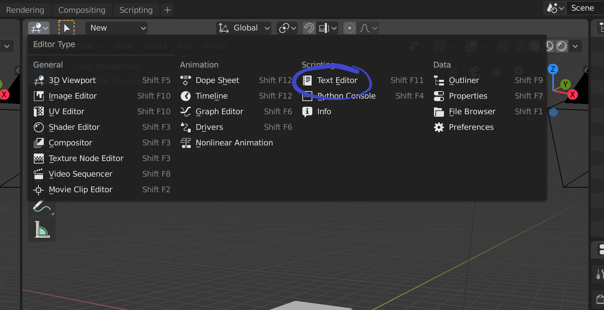

# Mad(dy)Man(deep)Huy

MadManHuy is a Blender 2.8 add-on, written in Python using scikit-image and scikit for Digital Image Processing final project.

## Installation and Usage

Install `python3`, and use pip to install `opencv-python`, `pydicom`.

Navigate to the directory where python3 is installed. Find the path to `opencv-python` and `pydicom` in `site-packages`. If the path is not yet included at the top of `marching_cubes_script.py`, do `sys.path.append("path")`.

With [Blender 2.80](https://www.blender.org/2-8/) installed and opened, [drag open another window](https://docs.blender.org/manual/es/dev/interface/window_system/areas.html?highlight=split%20window), then change the window to a text editor window (`Shift+F11`).

Click open, then navigate to `marching_cubes_script.py` and open it. Change the path of the images in the script to the directory storing the images, then click `Run Script`.

## Resources

Useful Resources for Blender 2.80 dev
https://wiki.blender.org/wiki/Reference/Release_Notes/2.80/Python_API/Addons#Naming
https://wiki.blender.org/wiki/Reference/Release_Notes/2.80/Python_API/Scene_and_Object_API
